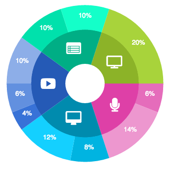
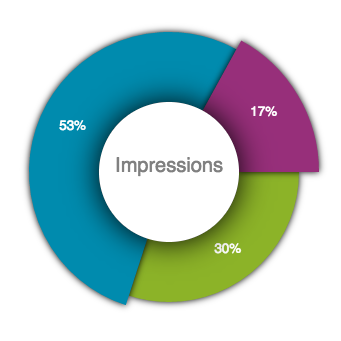
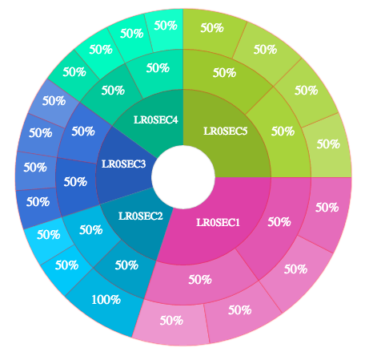
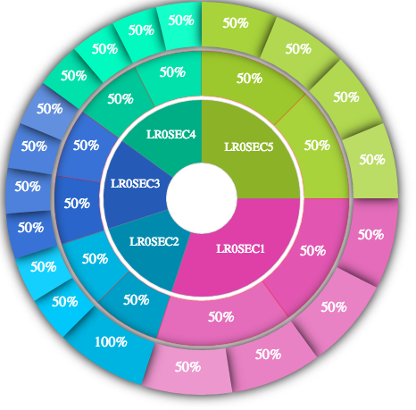

# DynamicWheelChart

Welcome to the DynamicWheel pie chart. We will go over all of the customizable options as well as the edits and additions for future versions. Let us jump right in and learn how to recreate the second wheel (Impressions Wheel) depicted above.

~~~javascript
var newStackedWheel = new DynamicWheel(domElement, jSONsettinggsANDdata);
newStackedWheel.drawWheel();
~~~

We instantiate a class of DynamicWheel by feeding it:

* The Canvas DOM element where the draws and fills will take place. This is simple enough. We find elementByID and done!

* A jSON object that contains the data and settings of the wheel. This is where all the magic happens. It is imperative that the data is structured the correct way. Below is the input jSON for the impressions wheel above. Let's break it down. 

~~~javascript
  {
    type: 'stacked-wheel',
    innerDescription_s: "Impressions",
    data: {
        sections: data,
    },
    options: {
      layers: [
        {
          minimumWidth_i: 60,
          maximumWidth_i: 80,
          textColor_s: "white",
          textFont_s: '10pt Helvetica',
          sectionShadowColor_s: "black",
          sectionShadowThickness_s: 10,
          textShadowThickness_s: 0,
          textShadowColor_s: "none", // none is prob redundant. if thickness is zero then thats good enough
          printOption_s: "percent", // description, percent, parent-percent, icon
          colorSchemeType_s: 'custom', // custom, parent-color-range
          colorScheme_a_s: ["hsla(77, 63%, 43%, 1)", "hsla(192, 100%, 34%, 1)", "hsla(317, 52%, 39%, 1)"]
        }
      ],
      initialRadius_i: 100,
      radiusPop_i: -1,
      animation_b: true,
      centeredCircle_b: true,
      centeredCircleColor_s: 'white',
      centeredCircleShadowThickness_s: 50,
      centeredCircleShadowColor_s: "black",
      innerText_b: true,
      innerTextColor_s: "grey",
      innerTextFont_s: '15pt Helvetica',
      innerTextShadowThickness_s: 0,
      innerTextShadowColor_s: "grey",
      animationSpeed_i: 2,
      containerSize_a_i: [350, 350]
    }
  }
~~~

This jSON is essentially broken up into tow main parts. We have the options and the data. Let's go over the options first. Inside options, we have settings that pertain to the entire wheel, like turning on and off the animation, and we have settings that pertain to each layer. This wheel, as can be seen, only has one layer, so the layers array only contains one object. But if we take a look at the following wheel and the corresponding jSON, we can see three layers in the options.

~~~javascript
  {
    type: 'stacked-wheel',
    innerDescription_s: "none",
    data: {
        sections: data,
    },
    options: {

      layers: [
        {
          minimumWidth_i: 70,
          maximumWidth_i: 70,
          textColor_s: "white",
          textFont_s: '10pt FontAwesome',
          // textFont_s: '10pt Helvetica',
          sectionShadowColor_s: "grey",
          sectionShadowThickness_s: 1,
          textShadowThickness_s: 0,
          textShadowColor_s: "none", // none is prob redundant. if thickness is zero then thats good enough
          printOption_s: "description", // description, percent, parent-percent, icon
          colorSchemeType_s: 'custom', // custom, parent-color-range
          colorScheme_a_s: ["hsla(321, 70%, 56%, 1)", "hsla(192, 100%, 34%, 1)", "hsla(218, 66%, 43%, 1)", "hsla(166, 100%, 34%, 1)", "hsla(77, 63%, 43%, 1)"]
        },
        {
          minimumWidth_i: 50,
          maximumWidth_i: 50,
          textColor_s: "white",
          textFont_s: '12pt FontAwesome',
          // textFont_s: '10pt Helvetica',
          sectionShadowColor_s: "red",
          sectionShadowThickness_s: 1,
          textShadowThickness_s: 0,
          textShadowColor_s: "none", // none is prob redundant. if thickness is zero then thats good enough
          printOption_s: "percent", // description, percent, parent-percent, icon
          colorSchemeType_s: 'parent-color-range', // custom, parent-color-range
          colorScheme_a_s: ["hsla(321, 70%, 56%, 1)", "hsla(192, 100%, 34%, 1)", "hsla(218, 66%, 43%, 1)", "hsla(166, 100%, 34%, 1)", "hsla(77, 63%, 43%, 1)"]
        },
        {
          minimumWidth_i: 50,
          maximumWidth_i: 50,
          textColor_s: "white",
          textFont_s: '12pt FontAwesome',
          // textFont_s: '10pt Helvetica',
          sectionShadowColor_s: "red",
          sectionShadowThickness_s: 1,
          textShadowThickness_s: 0,
          textShadowColor_s: "none", // none is prob redundant. if thickness is zero then thats good enough
          printOption_s: "percent", // description, percent, parent-percent, icon
          colorSchemeType_s: 'parent-color-range', // custom, parent-color-range
          colorScheme_a_s: ["hsla(321, 70%, 56%, 1)", "hsla(192, 100%, 34%, 1)", "hsla(218, 66%, 43%, 1)", "hsla(166, 100%, 34%, 1)", "hsla(77, 63%, 43%, 1)"]
        }
      ],
      initialRadius_i: 75,
      innerText_b: false,
      centeredCircle_b: false,
      centeredCircleColor_s: 'white',
      centeredCircleShadowThickness_s: 10,
      centeredCircleShadowColor_s: "red",
      innerTextColor_s: "black",
      innerTextFont_s: '10pt Helvetica',
      innerTextShadowThickness_s: 0,
      innerTextShadowColor_s: "none",
      radiusPop_i: 0,
      animation_b: true,
      animationSpeed_i: 6,
      containerSize_a_i: [500, 500]
    }
  }
~~~

## The global settings for the wheel consist of:

* initialRadius_i
	* This represents the radius of the donut, but it does not work alone. This radius specifically represents the distance between the center of the circle to the middle of the of the sections in the first layer. So, if the sections in the first layers have a width of 100, and initialRadius has a value of 50, the wheel will not have an interior hole. This is important to note because the initialRadius has to be at least 50% of the minimum width of the firt layer. Otherwise funky visuals will be produced. 

* innerText_b
	* Do you want text in the donut hole as shown in the impressions wheel. True or False
* centeredCircle_b
	* Do you want the donut hole to be filled. The impressions wheel actually has this effect. If you look closely, you can see a shodow on the inner ring. This is done by creating a white circle with a a blurred edge. Also True or False
* centeredCircleColor_s
	* Color of the centered circle. String or whatever color format you would like to use.
* centeredCircleShadowThickness_i
	* Shadow of the centered circle. This is a integer value that you can play around with. 
* centeredCircleShadowColor_s
	* Color of shadow. 
* innerTextColor_s	
* innerTextFont_s
* innerTextShadowThickness_s
* innerTextShadowColor_s
* radiusPop_i
	* This feature adds a gap between all layers as can be seen with the difference of the last previous two three-layer wheels.
* animation_b
	* This is a true or false option for whether you want the wheel to animate on load.  
* animationSpeed_i
	* The speed of the animation in integer form. 1 is the slowest and you can go as high as you would like. 
* containerSize_a_i
	* Array of two integers representing height and width.

## The layer settings for the wheel consist of:

* minimumWidth_i
* maximumWidth_i
* textColor_s
* textFont_s
* sectionShadowColor_s
* sectionShadowThickness_s
* textShadowThickness_s
* textShadowColor_s
* printOption_s
* colorSchemeType_s
* colorScheme_a_s

## The Data

For the simple impressions wheel, the data object is

~~~javascript
var data = {
  data: [
    {
      description_s: "microphone",
      iconUnicode_s: '\uf130',
      percentageArc_i: 30,
    },
    {
      description_s: "desktop",
      iconUnicode_s: '\uf108',
      percentageArc_i: 53,
    },
    {
      description_s: "video",
      iconUnicode_s: '\uf16a',
      percentageArc_i: 17,
    },
  ]
};
~~~

For the 3 layered wheel, the data object is

~~~javascript
var data = {
  data: [
  {
    description_s: "LR0SEC1",
    percentageArc_i: 30,
    data: [
      {
        description_s: 'LR1SEC2',
        percentageArc_i: 50,
        data: [
          {
            description_s: 'LR2SEC3',
            percentageArc_i: 50
          },
          {
            description_s: 'LR2SEC4',
            percentageArc_i: 50
          }
        ]
      },
      {
        description_s: 'LR1SEC3',
        percentageArc_i: 50,
        data: [
          {
            description_s: 'LR2SEC5',
            percentageArc_i: 50
          },
          {
            description_s: 'LR2SEC6',
            percentageArc_i: 50
          }
        ]
      }
    ]
  },
  {
    description_s: "LR0SEC2",
    percentageArc_i: 15,
    data: [
      {
        description_s: 'LR1SEC4',
        percentageArc_i: 50,
        data: [
          {
            description_s: 'LR2SEC7',
            percentageArc_i: 100
          }
        ]
      },
      {
        description_s: 'LR1SEC5',
        percentageArc_i: 50,
        data: [
          {
            description_s: 'LR2SEC8',
            percentageArc_i: 50
          },
          {
            description_s: 'LR2SEC9',
            percentageArc_i: 50
          }
        ]
      }
    ]
  },
  {
    description_s: "LR0SEC3",
    percentageArc_i: 15,
    data: [
      {
        description_s: 'LR1SEC6',
        percentageArc_i: 50,
        data: [
          {
            description_s: 'LR2SEC10',
            percentageArc_i: 50
          },
          {
            description_s: 'LR2SEC11',
            percentageArc_i: 50
          }
        ]
      },
      {
        description_s: 'LR1SEC7',
        percentageArc_i: 50,
        data: [
          {
            description_s: 'LR2SEC12',
            percentageArc_i: 50
          },
          {
            description_s: 'LR2SEC13',
            percentageArc_i: 50
          }
        ]
      }
    ]
  },
  {
    description_s: "LR0SEC4",
    percentageArc_i: 15,
    data: [
      {
        description_s: 'LR1SEC8',
        percentageArc_i: 50,
        data: [
          {
            description_s: 'LR2SEC14',
            percentageArc_i: 50
          },
          {
            description_s: 'LR2SEC15',
            percentageArc_i: 50
          }
        ]
      },
      {
        description_s: 'LR1SEC9',
        percentageArc_i: 50,
        data: [
          {
            description_s: 'LR2SEC16',
            percentageArc_i: 50
          },
          {
            description_s: 'LR2SEC17',
            percentageArc_i: 50
          }
        ]
      }
    ]
  },
  {
    description_s: "LR0SEC5",
    percentageArc_i: 25,
    data: [
      {
        description_s: 'LR1SEC10',
        percentageArc_i: 50,
        data: [
          {
            description_s: 'LR2SEC18',
            percentageArc_i: 50
          },
          {
            description_s: 'LR2SEC19',
            percentageArc_i: 50
          }
        ]
      },
      {
        description_s: 'LR1SEC11',
        percentageArc_i: 50,
        data: [
          {
            description_s: 'LR2SEC20',
            percentageArc_i: 50
          },
          {
            description_s: 'LR2SEC21',
            percentageArc_i: 50
          }
        ]
      }
    ]
  },
]
};
~~~
This structuring of the data this way is essential. 

